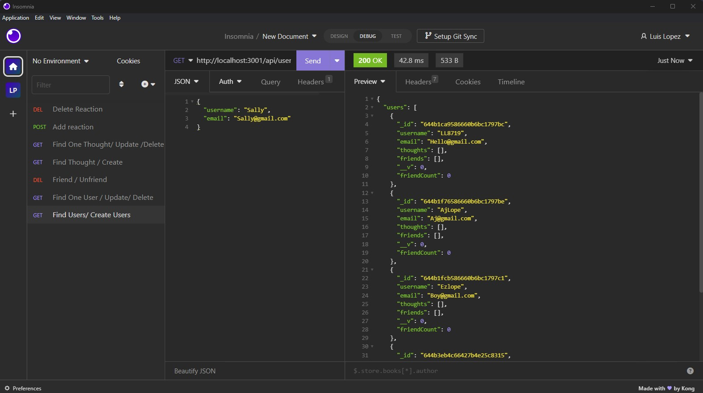

# Social Network API

### This project is licensed under the MIT license.

[Link: MIT](https://opensource.org/licenses/MIT)

- [License](#license)

## Description

Social Network API is an API for a social network web application where users can share their thoughts, react to friends’ thoughts, and create a friend list. It uses Express.js for routing, a MongoDB database, and the Mongoose ODM. In addition to using the Express.jsLinks and Mongoose packages.

## Table of Contents (Optional)

- [Description](#description)
- [Installation](#installation)
- [Usage](#usage)
- [License](#license)
- [Contributing](#contributing)
- [Test](#test)
- [Questions](#questions)

## <a href="Installation">Installation</a>

Application is not deployed. From the command line run "npm i" to install the required packages and then "node index" to run the application. The routes can be tested though a program like "insomnia".

## <a href="Usage">Usage</a>

Test "get, post, put and delete" routes in the cross-platform desktop application of your choice.

## <a href="License">License</a>

MIT

## <a href="Contributing">Contributing</a>

Any contributions are welcome by reviewing and identifying any bugs or issues that need to be fixed, along with suggestions on features or improvements that could be added to the application.

## <a href="Tests">Tests</a>

Routes have been tested through insomnia.

## <a href="Questions">Questions</a>

for questions please either open an issue on GitHub or contact me via email.

### Use the following links to contact me

[GitHub Profile](https://github.com/LL8719/).
[:envelope_with_arrow:](arsgatslr_87@yahoo.com).
